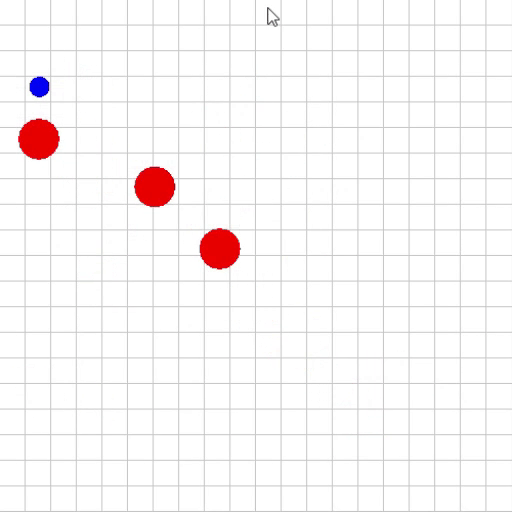

# Prey Predator simulation

This repository contains the code for a prey predator simulation. The simulation is based on a grid world where the prey and predator move around. The prey moves randomly and the predator moves towards the prey. All agents are trained using reinforcement learning, and more specifically, MADDPG. MADDPG is an extension of DDPG that allows multiple agents to learn in a cooperative or competitive environment. Refer to the [report](assets/report.pdf) for more details.

Full report: [report.pdf](assets/report.pdf)

Poster: [poster.pdf](assets/poster.pdf)

